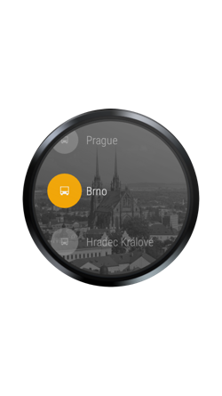

# SMS Ticket
[](https://travis-ci.org/avast/android-styled-dialogs) [](https://github.com/avast/android-styled-dialogs/blob/master/LICENSE.txt)

 
 

Get it:

<a href="https://play.google.com/store/apps/details?id=eu.inmite.apps.smsjizdenka&hl=en"></a>

Features:

- up-to date database of tickets for many cities supporting SMS tickets
- notifications about expiration of tickets
- statistics how much you spent on tickets
- Android Wear support - buy tickets from your watch!

## History

SMS Ticket was a very first app of a young company Inmite in 2009. It started as 20% project and guys used the app for practicing Android development. Android was a very young platform back then with only one phone, T-Mobile G1!

The app quickly become #1 app for ordering SMS Tickets in Czech Republic and Slovakia. Company Inmite grew as well with a lot of interesting projects. A lot of Inmite guys contributed to the app, the app was always a playground for new technologies before we were allowed to use them in commercial projects.

In 2014 Inmite got acquired by Avast. We continued to learn new things with the app by adding Android Wear support. In June 2015 we decided to open-source the whole app to ensure flourishing future for the app and to show our commitment to the open-source community. Let's play with new technologies together!

## How to contribute to the app

We analyzed our code and identified places for improvements. All of them are added to [issues](/issues). We also added common feature requests from our users.

**Pull requests are welcomed!**

Please set your Android Studio formatting to [our code style](https://github.com/avast/android-styled-dialogs/blob/master/code-formatting-config.xml).

PS: Contributing to our projects increases your chances in being hired at Avast!

## How to add a new city or modify data about tickets

The data are open-source as well! Have a look at them at tickets2.json

We encourage you to modify the tickets2.json file and send a pull request. Make sure you also increase version in version2.json file.

We also created unit tests for testing parsing of the data. When you are adding a new ticket, write test as well to make sure it correctly parses = works in the app.

## How to build the code

First add these constants into your `home/.gradle/gradle.properties` file:
```
RELEASE_STORE_FILE=path/to/your/keystore
RELEASE_STORE_PASSWORD=keystore password
RELEASE_KEY_ALIAS=key alias
RELEASE_KEY_PASSWORD=alias password
```

Then you should be able to import the project to the latest Android Studio with no problems.

## What about releases?

Avast will still maintain release process, QA and deploying new versions of data (they are independent of version of the app). Therefore you can focus on playing with the code and leave the boring stuff to us!

## License

The app and data are used under Apache 2 License. That means that your work based on this app doesn't have to be open-source, but please give us attribution. Put a link to this repo to your About screen and [let us know](mailto:vavra@avast.com).
