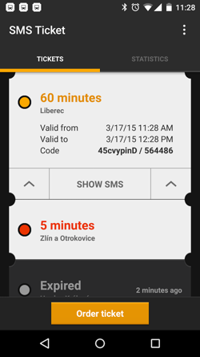

# SMS Ticket
[](https://travis-ci.org/avast/sms-ticket) [](https://github.com/avast/sms-ticket/blob/master/LICENSE.txt)

 
 

Features:

- up-to-date database of tickets for many cities supporting SMS tickets
- notifications about expiration of tickets
- statistics how much you have spent on tickets
- Android Wear support - buy tickets from your watch!

## History

SMS Ticket was the very first app of a young company Inmite in 2009. It started as a 20% project and the guys used the app for practicing Android development. Android was a very young platform back then with only one supported phone, T-Mobile G1!

The app quickly become #1 app for ordering SMS Tickets in the Czech Republic and Slovakia. Inmite grew as well with a lot of other interesting projects. A lot of Inmite guys contributed to the app, which was always a playground for new technologies before we were allowed to use them in commercial projects.

In 2014, Inmite was acquired by Avast. We continued to learn new things with the app by adding Android Wear support. In June 2015, we decided to open-source the whole app to support its flourishing future and to show our commitment to the open-source community. Let's play with new technologies together!

## How to contribute to the app

We analyzed our code and identified space for improvement. You can find it in [issues](https://github.com/avast/sms-ticket/issues). We also added common feature requests from our users.

**Pull requests are welcomed!**

Please set your Android Studio formatting to [our code style](https://github.com/avast/android-styled-dialogs/blob/master/code-formatting-config.xml).

PS: Contributing to our projects increases your chances of being hired to Avast!

## How to add a new city or modify data about tickets

The data are open-source as well! Have a look at them at [tickets2.json](mobile/src/main/assets/tickets2.json)

We encourage you to modify the tickets2.json file and send a pull request. Make sure you also increase version in the [version2.json](mobile/src/main/assets/version2.json) file.

We also created [unit tests for testing parsing of the data](mobile/src/test/java/eu/inmite/apps/smsjizdenka). When you are adding a new ticket, write a test as well to make sure it correctly parses = works in the app.

Run ```./gradlew testDebug``` before submitting a PR.

## How to build the code

First add these constants into your `home/.gradle/gradle.properties` file:
```
RELEASE_STORE_FILE=path/to/your/keystore
RELEASE_STORE_PASSWORD=keystore password
RELEASE_KEY_ALIAS=key alias
RELEASE_KEY_PASSWORD=alias password
```

### Crashlytics
To enable crash reporting via Crashlytics. Add Fabric config file `mobile/fabric.properties` containing:
```
apiKey=your api key
apiSecret=your api secret
```

Then you should be able to import the project to the latest Android Studio without any problems.

## What about releases?

The app wasn't updated as frequently as users would wish, so there are not going to be any further releases by Avast and the official app was removed from the Google Play store. The sources are going to stay on GitHub so that you can contribute and compile your app locally. Thanks to all who contributed to the app or used it.

## License

The app and data are released under [Apache 2 License](LICENSE.txt). That means that your work based on this app doesn't have to be open-source, but please give us attribution. Put a link to this repo to your About screen and [let us know](mailto:cadek@avast.com).